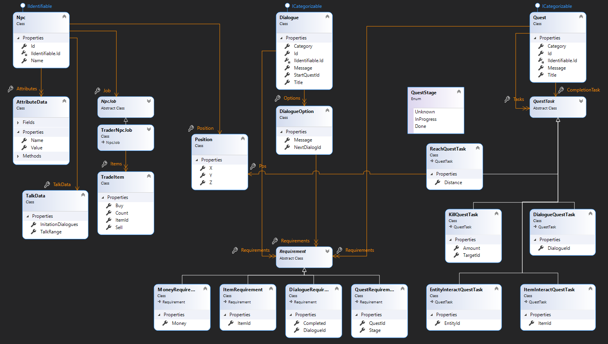

# 🛠️ 🚀 ResourceManager 

***ResourceManager is framework for fast development of simple software tool desktop application which provides ability to edit resources***

## 🎛️ Connection

Connection to data source allows to manipulate data within different storage like ftp, sql database or local OS file system   

### ⚙️ Supported Data Sources:

#### 📁 Local

This data source connects to local os file system with provided FolderPath - full path to root of all resources. Before using this connection make sure your account have read/write permissions in given folder path.

#### 📩 FTP

This data source connects to file system using FTP. It needs host, username and password to connect desired server. If port is set to 0, client will try to find correct port. If username and password will not be provided, it will connect to server as anonymous user, so make sure your server supports it. You can provide relative path to server root to use desired location. Before connecting to server make sure your account has read/write permissions to access given path.

#### 📦 ☁️ SQL

This data source connects to SQL database using connection string. Before using this connection make sure your login has select/insert/update/delete permissions for needed tables.

## ⚒️ Extending ResourceManager.Wpf

You can see in samples how to properly extend it, there are few important things you need to setup before succesfully creating ResourceManager app

#### 🚧 Models 
Quest, dialogues, tasks, npcs, any resource you want to manage you need to define on your own. **Main resources need to implement `IIdentifiable` interface**

#### 📝 Serialization ***(optional)*** 
This is just optimization step and is not required. ResourceManager.Wpf uses [Newtonsoft.Json](https://github.com/JamesNK/Newtonsoft.Json) by default, so registering own JsonConverter for each resource type will result in performance improvement and control about what is serialized and how.   

#### ✔️ Validation 
You must configure validation module so each resource must have own `IValidator<>` which is interface coming from [FluentValidation](https://github.com/FluentValidation/FluentValidation) library

#### DefaultDbContext ***(semi-optional)*** 
If you want support SQL Data Source, it's required to configure model creation with own DbContext.
   
#### 🔨 WPF project extension
- Make sure your `App.cs` extend `ResourceManagerApplication` 
- Create `RegionTabModuleBase` implementation 
- Register your `RegionTabModuleBase` implementation in `App.cs` like `protected override void ConfigureModuleCatalog(IModuleCatalog moduleCatalog) => moduleCatalog.AddModule<YourTabModule>();` 
- Configure data sources which you want to support using `protected override void ConfigureDataSources(IConfigurableDataSourceBuilder builder)` 
- ***(optional)*** Configure json settings in `protected override JsonSerializerSettings CreateJsonSettings()` (add your converters) 

- Add static converters to `App.xaml` with `<ResourceDictionary Source="pack://application:,,,/ResourceManager.Wpf;component/Themes/Converters.xaml" />` 
- Add default themes to `App.xaml` with `<ResourceDictionary Source="pack://application:,,,/ResourceManager.Wpf;component/Themes/Generic.xaml" />` 

ViewModels
- Any editable resource can just extend `ModelDialogViewModel<>`
- Any resource that has it's own Tab can just extend `ModelsManagerViewModel<>` or `CategoryModelsManagerViewModel<>`

***(optional)*** AutoControl system in Views
- Types that can be auto templated should extend `AutoTemplate` 
- Extend `DefaultAutoTemplateProvider`, register your `AutoTemplate`'s and register `IAutoTemplateProvider`

## 🎓 RpgDataEditor Sample

### Resources
RpgDataEditor uses 3 resources: 🧔 Npc, ☑️ Quest, 💭 Dialogue. They are shown with their relations and dependencies in picture below:

## 🤝 Contributing

You can freely contribute with us by reporting issues and making pull requests!
Please read [CONTRIBUTING.md](https://github.com/Prastiwar/ResourceManager/blob/master/.github/CONTRIBUTING.md) for details on contributing.

## 📘 License

This project is licensed under the MIT License - see the [LICENSE.md](https://github.com/Prastiwar/ResourceManager/blob/master/LICENSE) file for details.
